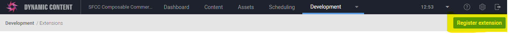
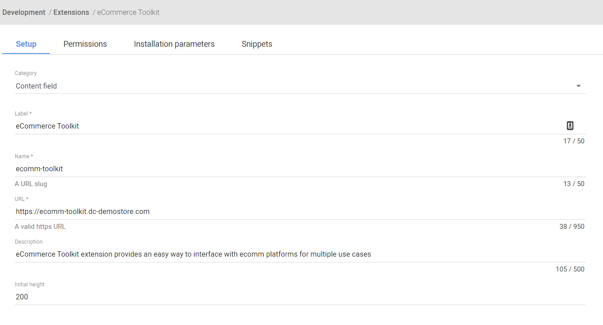
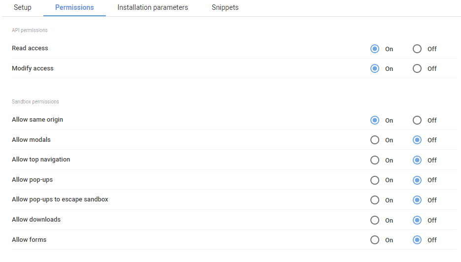
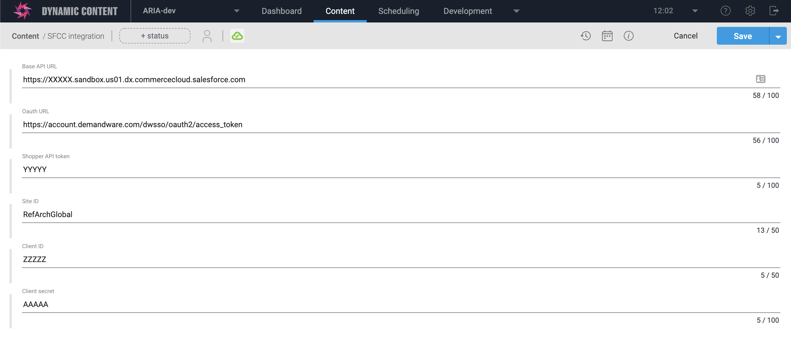
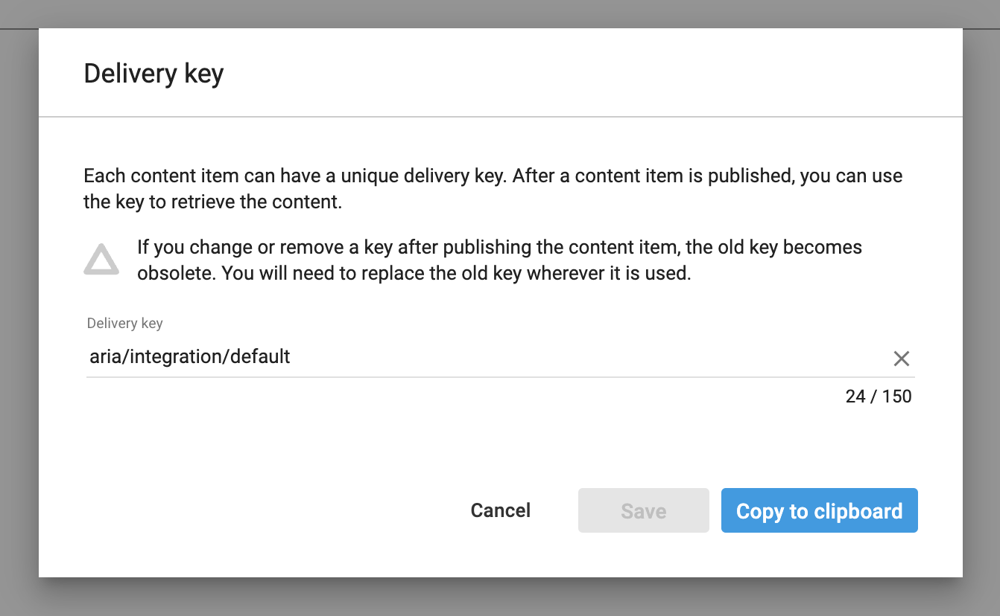
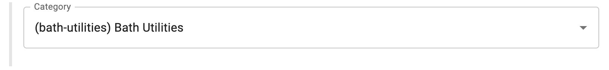
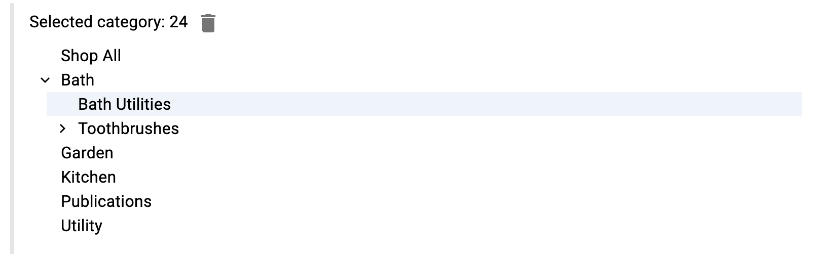

[](https://amplience.com/dynamic-content)

# eComm Swiss Army Knife

`dc-extension-ecom-swissarmyknife` is an extension written in React/MUI/Typescript for Amplience Dynamic Content that provides an eassy way to interface with 'X' ecomm platform for multiple use cases. The extension currently supports SFCC, with more eComm support in the works. Here's a list of high-level current/future features:

## Supported e-comm platforms
- Salesforce Commerce Cloud
- Commercetools (future release)
- BigCommerce (future release)
- TODO etc?

## Supported features
- Category selector
- User Segment selector
- Campaign/Promo selector (future release)
- Product Finder/Selector (future release)

## Getting Started with Swiss Army Knife

There are many ways one may use a Swiss Army Knife, but first you'll want to register the extension against an Amplience Dynamic Content Hub. Login to your Hub and head to Development > Extensions and click the "Register" button.



### Base Extension Setup 
Under the setup tab, enter the following (URL should be `https://dc-extension-category-selector.vercel.app/`) 



### Host your own Setup
You can also clone this repository and deploy to services such as Vercel.

```bash
$ gh repo clone amplience/dc-extension-ecom-swissarmyknife
$ cd dc-extension-ecom-swissarmyknife
$ vercel deploy
Vercel CLI 24.0.0
? Set up and deploy “~/Workspace/amplience/dc-extension-ecom-swissarmyknife”? [Y/n] y
? Which scope do you want to deploy to? zzzzz
? Link to existing project? [y/N] n
? What’s your project’s name? dc-extension-ecom-swissarmyknife
? In which directory is your code located? ./
Auto-detected Project Settings (Next.js):
- Build Command: next build
- Output Directory: Next.js default
- Development Command: next dev --port $PORT
? Want to override the settings? [y/N] n
🔗  Linked to zzzzz/dc-extension-ecom-swissarmyknife (created .vercel)
🔍  Inspect: https://vercel.com/zzzzz/dc-extension-ecom-swissarmyknife/xxxxxx [1s]
✅  Production: https://dc-extension-ecom-swissarmyknife-yyyyy.vercel.app [copied to clipboard] [2m]
📝  Deployed to production. Run `vercel --prod` to overwrite later (https://vercel.link/2F).
💡  To change the domain or build command, go to https://vercel.com/zzzzz/dc-extension-ecom-swissarmyknife/settings
```

You can then use the new depolyment URL in your extension configuration.

### Extension Permissions Settings
Under the Permissions tab, select the following:



### Extensions Installation Parameters

#### Installation Parameters only config

Installation Parameters is where you'll enter your E-comm platform-specific environment settings and credentials. If you're on SFCC, they will look like the following:

```json
{
  "api_url": "https://YOURINSTANCE.dx.commercecloud.salesforce.com",
  "auth_url": "https://account.demandware.com/dwsso/oauth2/access_token",
  "api_token": "clientId:secret",
  "client_id": "xxxxxxxxx-xxxx-xxxx-xxxx-xxxxxxxxxxxx",
  "client_secret": "TheClientPWYouSetInAccountMgr"
  "site_id": "RefArchGlobal",
}
```
N.B. that the `api_token` needs to be base64 encoded.

#### Installation parameters using a configuration Content Item

It's also possible to content manage the configuration. You can create configuration object using the following schema (SFCC example):

```json
{
	"$schema": "http://json-schema.org/draft-07/schema#",
	"$id": "https://demostore.amplience.com/site/integration/sfcc",

	"title": "SFCC integration",
	"description": "Description",

	"allOf": [
		{
			"$ref": "http://bigcontent.io/cms/schema/v1/core#/definitions/content"
		}
	],
	
	"type": "object",
	"properties": {
		"api_url": {
			"title": "Base API URL",
			"type": "string",
			"minLength": 0,
			"maxLength": 100
		},
		"auth_url": {
			"title": "Oauth URL",
			"type": "string",
			"minLength": 0,
			"maxLength": 100
		},
		"api_token": {
			"title": "Shopper API token",
			"type": "string",
			"minLength": 0,
			"maxLength": 100
		},
		"site_id": {
			"title": "Site ID",
			"type": "string",
			"minLength": 0,
			"maxLength": 50
		},
		"client_id": {
			"title": "Client ID",
			"type": "string",
			"minLength": 0,
			"maxLength": 50
		},
		"client_secret": {
			"title": "Client secret",
			"type": "string",
			"minLength": 0,
			"maxLength": 100
		}
	},
	"propertyOrder": [
		"api_url",
		"auth_url",
		"api_token",
		"site_id",
		"client_id",
		"client_secret"
	]
}
```

Content Item in Dynamic Content would look like the following:



You then need to specify the Delivery Key for that configuration object to be taken into account as the default one with `aria/integration/default`:



Once the configuration object is setup, you can simply configure your installation parameters with the following:

```json
{
  "config_locator": "<hubname>:default"
}
```

This will allow you to quickly switch from one configuration to another.

### Extension Snippets

Since the Swiss Army knife requires a number of "Instance Parameters", we recommend providing a number of extension snippets for ease of use and to ensure functionality. By including Snippets in an extension registration, you'll be able to quickly configure properties when you're editing/creating a Content Schema that are automatically associated with an extension.


The Instance Parameters are all included in the snippets and will drive how the extension looks and functions, and what type of data will be retrieved from your e-comm platform. 

Under the Snippets tab, add snippets using each of the following:

#### User Segments - Multi select - object

View screenshot:


Schema:

```json
{
  "title": "User Segments",
  "description": "Multi-select User Segments and store as {name:string,id:string}",
  "type": "array",
  "minItems": 0,
  "maxItems": 5,
  "items": {
    "type": "object",
    "properties": {
      "id": {
        "title": "ID",
        "type": "string"
      },
      "name": {
        "title": "Name",
        "type": "string"
      }
    }
  },
  "ui:extension": {
    "name": "swiss-army-knife",
    "params": {
      "label": "User Segments",
      "view": "multi",
      "data": "segment",
      "type": "object"
    }
  }
}
```

Sample content:

```json
{
  "content": {
    "items": [
      {
        "id": "2",
        "name": "Big Spenders"
      },
      {
        "id": "1",
        "name": "VIP"
      }
    ]
  }
}
```

#### User Segments - Multi select - string

View screenshot:


Schema:

```json
{
  "title": "User Groups",
  "description": "Multi-select User Segments and store as string",
  "type": "array",
  "minItems": 0,
  "maxItems": 5,
  "items": {
    "type": "string"
  },
  "ui:extension": {
    "name": "swiss-army-knife",
    "params": {
      "label": "User Segments",
      "view": "multi",
      "data": "segment",
      "type": "string"
    }
  }
}
```

Sample content:

```json
{
  "content": {
    "items": [
      "1",
      "2"
    ]
  }
}
```

#### Category - Single Select - object

View screenshot:



Schema:

```json
{
  "title": "Category",
  "description": "Single-select Category and store Name,ID as {name:string,id:string}",
  "type": "object",
  "properties": {
    "name": {
      "title": "Name",
      "type": "string"
    },
    "id": {
      "title": "ID",
      "type": "string"
    }
  },
  "propertyOrder": [
    "id",
    "name"
  ],
  "ui:extension": {
    "name": "swiss-army-knife",
    "params": {
      "label": "Category",
      "view": "single",
      "data": "category",
      "type": "object"
    }
  }
}
```

Sample content:

```json
{
  "content": {
    "propertyName": {
      "name": "(bath-utilities) Bath Utilities",
      "id": "24"
    }
  }
}
```

#### Category - Single Select - string

View screenshot:


Schema:

```json
{
  "title": "Category",
  "description": "Single-select Category and store ID as string",
  "type": "string",
  "ui:extension": {
    "name": "swiss-army-knife",
    "params": {
      "label": "Category",
      "view": "single",
      "data": "category",
      "type": "string"
    }
  }
}
```

Sample content:

```json
{
  "content": {
    "propertyName": "24"
  }
}
```

#### Category - Single Select - enforced string

View screenshot:


Schema:

```json
{
  "title": "Category",
  "description": "Single-select Category and store ID as string",
  "type": "string",
  "pattern": "category\/.*",
  "ui:extension": {
    "name": "swiss-army-knife",
    "params": {
      "label": "Category",
      "view": "single",
      "data": "category",
      "type": "string"
    }
  }
}
```

Sample content:

```json
{
  "content": {
    "propertyName": "category/24"
  }
}
```

#### Category - Single Select Tree - string

View screenshot:



Schema:

```json 
{
  "title": "Category",
  "description": "Single-select Category Tree and store ID as string",
  "type": "string",
  "ui:extension": {
    "name": "swiss-army-knife",
    "params": {
      "label": "Category",
      "view": "tree",
      "data": "category",
      "type": "string"
    }
  }
}
```

Sample content:

```json
{
  "content": {
    "propertyName": "24"
  }
}
```

#### Category - Single Select Tree - enforced string

View screenshot:


Schema:

```json 
{
  "title": "Category",
  "description": "Single-select Category Tree and store ID as string",
  "type": "string",
  "pattern": "category\/.*",
  "ui:extension": {
    "name": "swiss-army-knife",
    "params": {
      "label": "Category",
      "view": "tree",
      "data": "category",
      "type": "string"
    }
  }
}
```

Sample content:

```json
{
  "content": {
    "propertyName": "category/24"
  }
}
```
 
 
