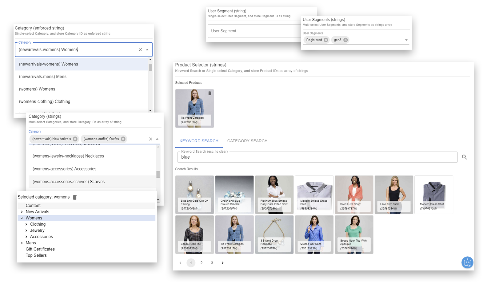

# eComm Toolkit

`dc-extension-ecomm-toolkit` is an Amplience Dynamic Content extension written in React/MUI/Typescript that provides an easy way to interface with platforms in the eCommerce ecosystem for multiple use cases.

## 🏢 Supported platforms

### 🛒 Commerce

-   [Salesforce Commerce Cloud (SFCC)](./docs/commerce/sfcc.md)
-   [BigCommerce CORS](./docs/commerce/bigcommerce-cors.md)
-   [Commercetools](./docs/commerce/commercetools.md)
-   [Shopify](./docs/commerce/shopify.md)
-   [REST (JSON Sample Data)](./docs/commerce/rest.md)

#### ⚙️ Features

-   Product Finder
-   Category selector
-   User Segment selector

## 🏁 Quickstart

We would reccomend that you build and host your own version of the extension so that you are in complete control of the the extension. Please see [Developing and Building Locally](./docs/developing%2Bbuilding-locally.md).

Instructions for basic registration & setup of the ecomm-toolkit in your Amplience Dynamic Content box [are here](./docs/extension.md). Then come back to the Snippets section below.

Most backends will require you to add the extension URL (Amplience hosted, self-hosted, localhost or otherwise) to their CORS allowed origins list to allow requests. See the commerce platform documentation above for more information on what needs to be done and available features.

If you're hosting the extension yourself and want to use features that are not allowed by CORS versions of vendor APIs, you can define the environment variable `INTEGRATION_MIDDLEWARE_SERVER=1` to allow the next server to host the middleware proxy, which should allow use of any API. This will also switch builds of the extension to attempt to use the middleware API by default instead of making CORS requests.

`middleware_url` can be provided on the extension config to use any middleware API server regardless of environment variable.

> Note: This extension also supports Big Commerce Server calls for access to 'customer groups'. This is an example of the server implementation and self hosting as per above. Configuration and codec parameters for this are here: [BigCommerce](./docs/commerce/bigcommerce.md)

## 🧩 Extension Snippets

Since the eComm Toolkit requires a number of "Instance Parameters", we recommend providing a number of extension snippets for ease of use and to ensure functionality. By including Snippets in an extension registration, you'll be able to quickly configure properties when you're editing/creating a Content Schema that are automatically associated with an extension.

The Instance Parameters are all included in the snippets and will drive how the extension looks and functions, and what type of data will be retrieved from your eComm platform.

You can find the code for all snippets in [data/snippets.json](./data/snippets.json) or in the following pages:

-   **Products**
    -   [Product Selector (string)](./docs/snippets/product-selector-string.md)
    -   [Product Selector (enforced string)](./docs/snippets/product-selector-enforced-string.md)
    -   [Product Selector (strings)](./docs/snippets/product-selector-strings.md)
-   **Categories**
    -   [Category (string)](./docs/snippets/category-string.md)
    -   [Category (enforced string)](./docs/snippets/category-enforced-string.md)
    -   [Category (strings)](./docs/snippets/category-strings.md)
    -   [Category (object)](./docs/snippets/category-object.md)
    -   [Category (objects)](./docs/snippets/category-objects.md)
    -   [Category Tree (string)](./docs/snippets/category-tree-string.md)
    -   [Category Tree (enforced string)](./docs/snippets/category-tree-enforced-string.md)
-   **User Segments**
    -   [User Segment (string)](./docs/snippets/user-segment-string.md)
    -   [User Segments (strings)](./docs/snippets/user-segments-strings.md)
    -   [User Segments (objects)](./docs/snippets/user-segments-objects.md)
    -   [User Segment (object)](./docs/snippets/user-segment-object.md)

## 🌍 Useful Links

-   [Contributing](./CONTRIBUTING.md)
-   [Support](./support.md)
-   [Licensing](./LICENSE)
-   [Codec Errors](./docs/errors.md)
