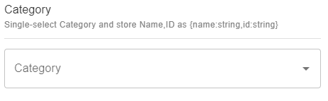

# Category (object)

Single-select Category, and store Name, ID as object:

```json
{
    "title": "Category (object)",
    "description": "Single-select Category, and store Name, ID as object",
    "type": "object",
    "properties": {
        "name": {
            "title": "Name",
            "type": "string"
        },
        "id": {
            "title": "ID",
            "type": "string"
        }
    },
    "propertyOrder": ["id", "name"],
    "ui:extension": {
        "name": "ecomm-toolkit",
        "params": {
            "label": "Category",
            "view": "single",
            "data": "category",
            "type": "object"
        }
    }
}
```

Sample content:

```json
{
    "categorySingleObject": {
        "name": "(bath-utilities) Bath Utilities",
        "id": "24"
    }
}
```

Sample UI:


