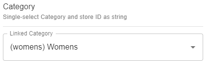
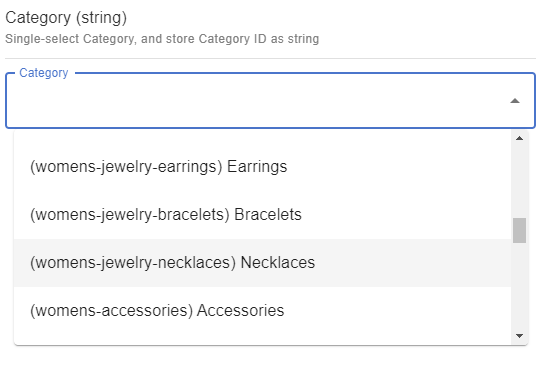

# Category (string)

## Snippet

Single-select Category, and store Category ID as string:

```json
{
    "title": "Category (string)",
    "description": "Single-select Category, and store Category ID as string",
    "type": "string",
    "ui:extension": {
        "name": "ecomm-toolkit",
        "params": {
            "label": "Category",
            "view": "single",
            "data": "category",
            "type": "string"
        }
    }
}
```

## Sample content

```json
{
    "categorySingleString": "24"
}
```

## Sample UI

Category selected:



Selecting a category:


