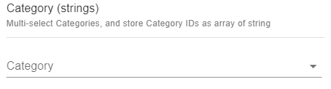
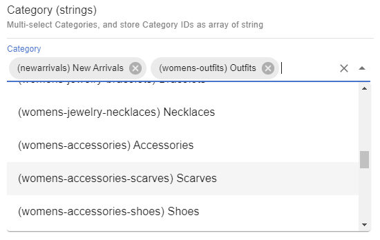

# Category (strings)

# Snippet

Multi-select Categories, and store Category IDs as array of string:

```json
{
	"title": "Category (strings)",
	"description": "Multi-select Categories, and store Category IDs as array of string",
	"type": "array",
	"items": {
		"type": "string"
	},
	"ui:extension": {
		"name": "ecomm-toolkit",
		"params": {
			"label": "Category",
			"view": "multi",
			"data": "category",
			"type": "string"
		}
	}
}
```

## Sample content

```json
{
	"categoryArrayStrings": ["23", "24", "18"]
}
```

## Sample UI

Empty field:


Selecting multiple categories:

