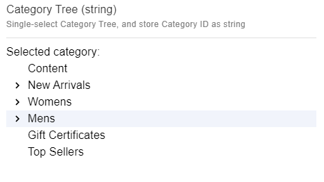
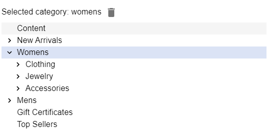

# Category Tree (string)

## Snippet

Single-select Category Tree, and store Category ID as string:

```json
{
    "title": "Category Tree (string)",
    "description": "Single-select Category Tree, and store Category ID as string",
    "type": "string",
    "ui:extension": {
        "name": "ecomm-toolkit",
        "params": {
            "label": "Category",
            "view": "tree",
            "data": "category",
            "type": "string"
        }
    }
}
```

# Sample content

```json
{
    "categorySingleStringTree": "24"
}
```

# Sample UI

No category selected:


Selecting a category:

