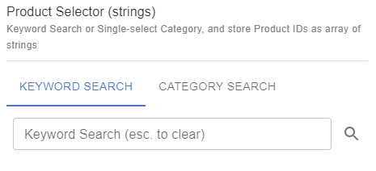
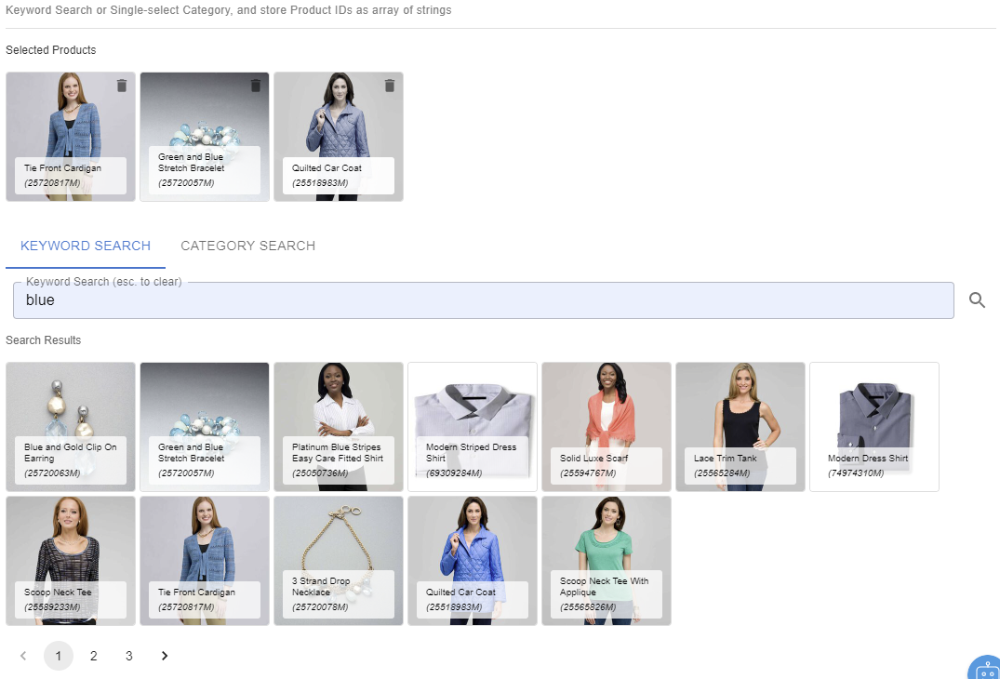
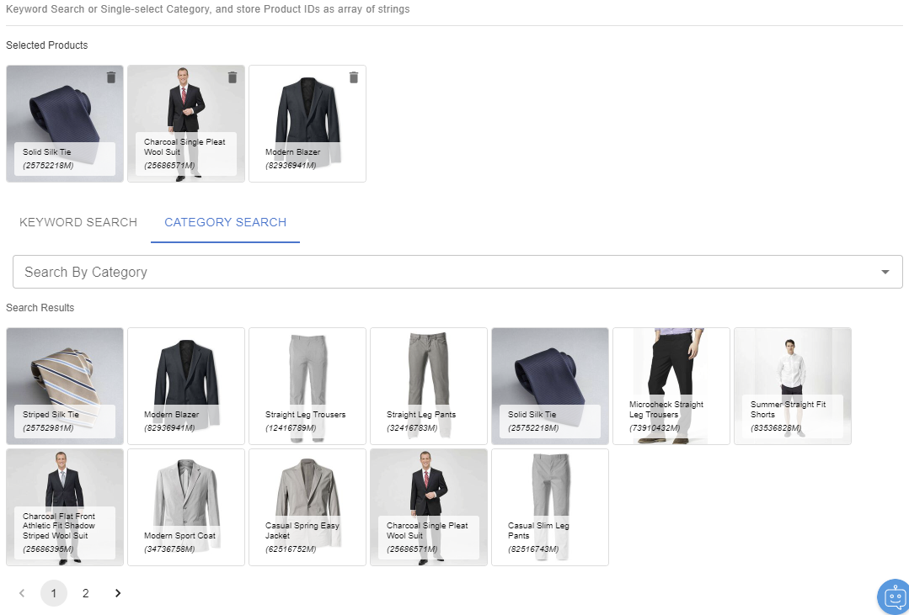

# Product Selector (strings)

## Snippet

Keyword Search or Single-select Category, and store Product IDs as array of string:

```json
{
    "title": "Product Selector (strings)",
    "description": "Keyword Search or Single-select Category, and store Product IDs as array of string",
    "type": "array",
    "items": {
        "type": "string"
    },
    "ui:extension": {
        "name": "ecomm-toolkit",
        "params": {
            "label": "Search By Category",
            "view": "product",
            "data": "product",
            "type": "strings"
        }
    }
}
```

## Sample Content

```json
{
    "productArrayStrings": [
        "25591072M", 
        "25517823M", 
        "25050730M", 
        "25594776M", 
        "25501952M"
    ]
}
```

## Sample UI

Empty field:



Sample Keyword Search:



Sample Category Search:


