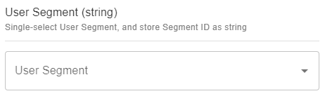

# User Segment (string)

## Snippet

Single-select User Segment, and store Segment ID as string:

```json
{
    "title": "User Segment (string)",
    "description": "Single-select User Segment, and store Segment ID as string",
    "type": "string",
    "ui:extension": {
        "name": "ecomm-toolkit",
        "params": {
            "label": "User Segment",
            "view": "single",
            "data": "segment",
            "type": "string"
        }
    }
}
```

## Sample content

```json
{
    "segmentSingleSelectString": "1"
}
```

## Sample UI

Empty field:


