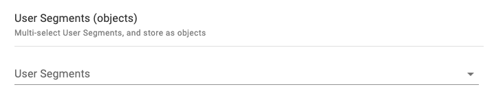
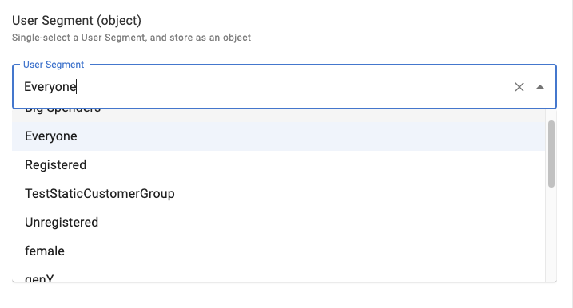

# User Segments (objects)

## Snippet

Multi-select User Segments, and store as object:

```json
{
    "title": "User Segments (objects)",
    "description": "Multi-select User Segments, and store as objects",
    "type": "array",
    "minItems": 0,
    "maxItems": 5,
    "items": {
        "type": "object",
        "properties": {
            "id": {
                "title": "ID",
                "type": "string"
            },
            "name": {
                "title": "Name",
                "type": "string"
            }
        }
    },
    "ui:extension": {
        "name": "ecomm-toolkit",
        "params": {
            "label": "User Segments",
            "view": "multi",
            "data": "segment",
            "type": "object"
        }
    }
}
```

## Sample content

```json
{
    "segmentMultiSelectObjects": [
        {
            "id": "2",
            "name": "Big Spenders"
        },
        {
            "id": "1",
            "name": "VIP"
        }
    ]
}
```

## Sample UI

Empty field:



Selecting multiple segments:


