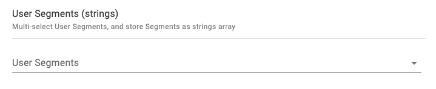
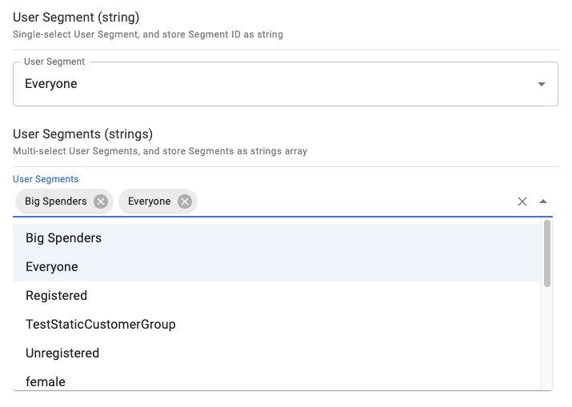

# User Segments (strings)

## Snippet

Multi-select User Segments, and store Segments as strings array:

```json
{
    "title": "User Segments (strings)",
    "description": "Multi-select User Segments, and store Segments as strings array",
    "type": "array",
    "minItems": 0,
    "maxItems": 5,
    "items": {
        "type": "string"
    },
    "ui:extension": {
        "name": "ecomm-toolkit",
        "params": {
            "label": "User Segments",
            "view": "multi",
            "data": "segment",
            "type": "string"
        }
    }
}
```

## Sample content

```json
{
    "segmentMultiSelectStrings": [
        "1", 
        "2"
    ]
}
```

## Sample UI

Empty field:



Selecting multiple segments:


